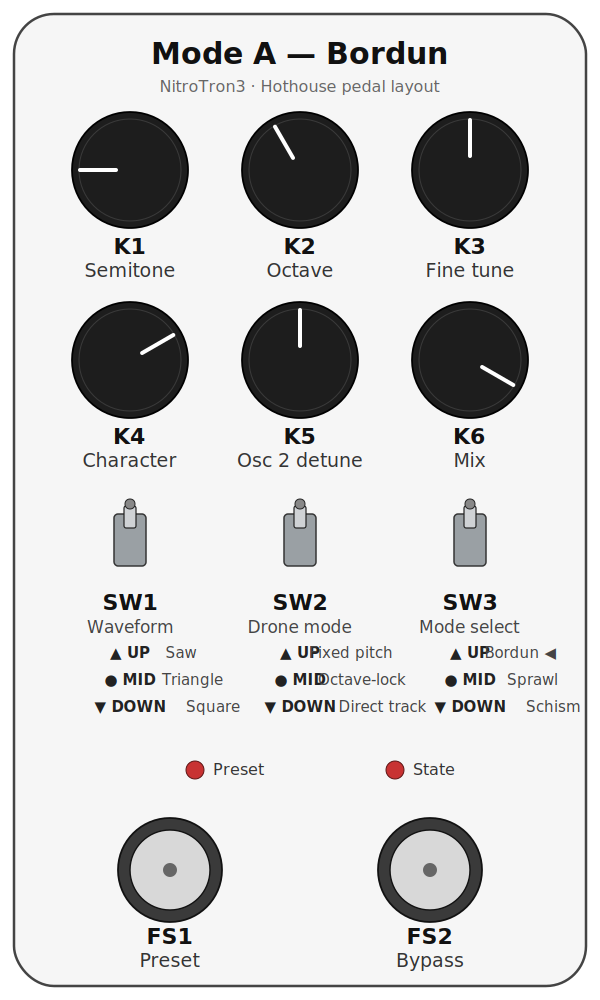
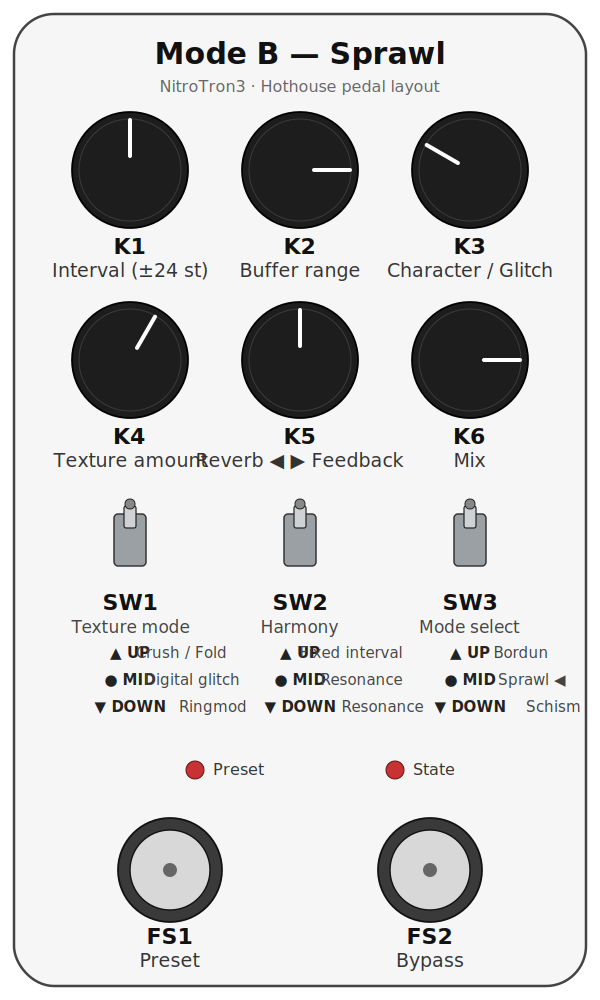
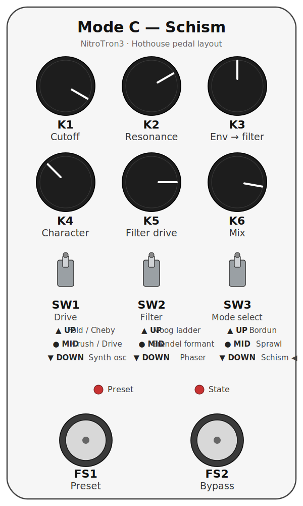

# NitroTron3

A project of [Nitro Mahalia](https://nitromahalia.net). This pedal
packages several of their signature bass-through-synth sounds into a
single bass-specific unit and more: three distinct modes, each doing
something not easily found in off-the-shelf pedals. Built on the
Electro-Smith Daisy Seed and Cleveland Music Co. Hothouse DSP kit.

## Modes at a glance

**BORDUN (Mode A).** A harmonic companion to the bass, modelled after a
specific usage of the Moog MoogerFooger FreqBox (MF-107) — its
envelope-gated oscillator mixed in alongside the dry signal, kept clean
of sync and FM modulation. An internally generated oscillator, gated and
shaped by the bass's own envelope, lays subtle or assertive
accompanying harmonics over the input — pure intervals, fifths, octaves,
drone-like wash. Placed **before** overdrive in the chain it stacks
musically into a saturated sound; on its own it sits as a parallel voice
along the played notes. Tracking modes lock the harmony to the played
pitch; fixed mode anchors a drone against which the bass moves.

**SPRAWL (Mode B).** Granular-delay-based texture and soundscape engine.
A rolling buffer feeds a grain scheduler whose voices can pitch-shift
non-linearly, drift, scatter, and stutter — built to fill the void
around the bass, intended for improvisation and experimental
performance. Functionally a multi-mode effect on its own: all colouring
and texturing stages (decimator/fold, event-driven glitch, ringmod,
frequency shifter) are reachable in a non-delay path too (K2 fully CCW).
High feedback with the tanh saturator pushes the loop into harmonic
cloud blooms; the Bode SSB shifter inside the feedback loop cascades
each pass and rapidly grows beyond pitched material.

**SCHISM (Mode C).** Dynamic bass filter and digital distortion unit,
with a fat pitch-tracked synth voice as a third drive option. The
filter can self-oscillate in a controlled manner — singing-into-screaming
textures that play well into a downstream overdrive or fuzz. The
bit-XOR drive enriches overtones cleanly and lights up especially well
placed **before** overdrive/fuzz. The phaser sub-mode is provisional
and likely to be replaced with a different effect in a future release.

**Presets.** A global preset system recalls mode + full parameter state
in one footswitch press. One global edit buffer, 3 banks × 8 slots = 24
reachable presets. Each slot carries its own mode, so cycling presets
can swap mode mid-set. See the *Footswitches and Presets* section
below.

## Hardware overview

- 6 knobs (K1–K6, left-to-right, top row then bottom)
- 3 three-position toggle switches (SW1–SW3)
- 2 footswitches (FS1 = preset / FS2 = bypass; both held together for
  bank-cycle / bootloader)
- 2 indicator LEDs

**SW3 selects the mode**:

- **UP** — BORDUN (Mode A)
- **MIDDLE** — SPRAWL (Mode B)
- **DOWN** — SCHISM (Mode C)

The mode determines what every other knob and switch does. Each mode is
documented in its own section below.

---

# BORDUN (Mode A)

A two-oscillator voice (waveform via SW1) tracks the bass input, gated
by an envelope follower so the drone only sounds while you play. A Moog
ladder filter shapes the tone; in triangle mode K4 crosses over into
wavefolding past noon. SW2 picks the pitch source: fixed, octave-locked
tracking, or direct tracking.

{.pedal-layout}

## Controls

| CONTROL | DESCRIPTION | NOTES |
|-|-|-|
| KNOB 1 | Semitone / Interval | ±12 semitone offset, centered with deadzone. **Fixed**: center = A, also sets the wrap point for tracking. **Track**: center = tracked note, wraps at the note set in fixed mode |
| KNOB 2 | Octave | 7 positions (C-1 – C5). **Octave-locked**: sets target octave. **Direct**: ±3 octave offset from tracked pitch |
| KNOB 3 | Fine tune | ±50 cents continuous (osc 1 only — creates beating with osc 2) |
| KNOB 4 | Tone / Wavefold | SAW/SQ: full ladder cutoff (80 Hz – 8 kHz). TRI: CCW → noon = cutoff, noon → CW = wavefolding (filter stays fully open) |
| KNOB 5 | Osc 2 detune | Center = off (deadzone). Outside center = ±1–12 semitone steps. Not affected by fine tune |
| KNOB 6 | Mix | 0 = full dry, 1 = full wet (oscillator) |
| SWITCH 1 | Waveform | **UP** — Saw • **MIDDLE** — Triangle • **DOWN** — Square |
| SWITCH 2 | Drone mode | **UP** — Fixed pitch (K1 sets note, K2 sets octave) • **MIDDLE** — Octave-locked tracking (pitch class follows bass in K2's octave, K1 adds interval) • **DOWN** — Direct tracking (osc follows exact bass pitch, K1/K2 are relative offsets ±12 semi / ±3 oct) |

---

# SPRAWL (Mode B)

8-second SDRAM ring buffer feeding 8 grain voices, with a choice of
texture shaper (SW1) and harmony source (SW2). K5 is bipolar — CCW
routes the wet bus through a Clouds reverb, CW drives a tanh-saturated
feedback loop with build-up and on-play duckers that keep the loop
musical. K2 fully CCW bypasses the grain engine and routes the dry
through the texture shaper directly, with K3 becoming a micro-stutter
control. SW2 DOWN replaces grain pitch-shifting with a Bode SSB
frequency shifter living inside the feedback loop.

{.pedal-layout}

## Controls

| CONTROL | DESCRIPTION | NOTES |
|-|-|-|
| KNOB 1 | Harmony / shift | Meaning follows SW2. **SW2=UP**: fixed interval, K1 = ±12 semitones. **SW2=MID**: resonance pick, K1 spans the ±36-semitone scan. **SW2=DOWN**: Bode SSB frequency shifter on the wet bus, bipolar with ±2 % deadzone — CCW = down-shift (bass), CW = up-shift, exponential taper, ±1 kHz at full deflection. In SW2 DOWN the grain buffer-read pitch is forced to unison |
| KNOB 2 | Buffer range | CCW = tight (100 ms). CW = deep (full 8 s). **Fully CCW** enters direct-texture mode (grain engine bypassed) |
| KNOB 3 | Character / Glitch | **Grain mode**: CCW = soft/long/tight, CW = short/sharp/chaotic. **Direct-texture mode**: micro-stutter — CCW = clean, CW = frequent choppy repeats |
| KNOB 4 | Texture amount | Depends on SW1 position — see below |
| KNOB 5 | Reverb / Feedback (bipolar) | **CCW** = Clouds reverb amount (0 → 1). **Center (±5 %)** = off. **CW** = ring-buffer feedback (0 → 0.95) into the tanh saturator. Reverb tail does not feed the ring buffer |
| KNOB 6 | Mix | 0 = full dry, 1 = full wet. Equal-power curve |
| SWITCH 1 | Texture mode | **UP** — Decimator / Wavefolder bipolar (K4 CCW = max crush, noon = clean, CW = wavefold) • **MIDDLE** — Event-driven digital glitch (bipolar K4: noon = clean ±5 %, CCW = random bit-flip events, CW = random timing events — freeze / stutter / reverse; sparse near noon → continuous at the extremes via event chaining) • **DOWN** — Ringmod (K4 0 – 30 % = tremolo 1 – 15 Hz, 30 – 100 % = bell partials, pitch-tracked with keytracked LPF) |
| SWITCH 2 | Harmony / shift | **UP** — Fixed interval (K1 = ±12 semitones above tracked note) • **MIDDLE** — Resonance (grains lock onto nearby harmonics; K1 spans ±36-semi scan) • **DOWN** — Bode SSB frequency shifter on the wet bus (inside the feedback loop). Grain buffer-read pitch forced to unison; K1 = ±1 kHz exponential |

---

# SCHISM (Mode C)

Two-stage chain: drive (SW1) → filter (SW2). K1–K3 drive the filter
selected by SW2; K4 drives the source flavor selected by SW1
(wavefolder / waveshaper, bit-flipper / overdrive, or pitch-tracked
synth oscillator). For SW1=UP and SW1=MID, K4 is bipolar around noon:
noon = clean dry, one flavor each side. K5 is a bipolar pre-filter drive
(attenuate / unity / boost, universal across all SW2 filter modes); K6
is the dry/wet mix.

Three filter flavors: a tuned **Moog ladder** (single input saturator,
cutoff-tracked resonance, asymmetric drive), a vowel-pathed **Grendel
formant** filter, and a 6-stage **phaser** with internal LFO. The
phaser runs slightly detuned per stage (organic, less "digital") with a
soft-saturated feedback loop, so K2 sweeps from a clean sweep up into
a resonant bloom / controlled self-oscillation. K3 is a bipolar
envelope-to-filter modulator with a center deadzone (or, on the phaser,
a bipolar LFO rate + shape selector).

Three drive flavors. For **SW1=UP** and **SW1=MIDDLE**, K4 is bipolar
around noon (noon = clean dry): turning it clockwise from noon brings up
one flavor, counter-clockwise the other. **SW1=UP** is the sine
wavefolder (K4 CW) and a Chebyshev waveshaper (K4 CCW) — an octave-up /
metallic harmonic generator with a pre-shaper low-pass so it makes a
clean octave instead of intermod mush. **SW1=MIDDLE** is a gated
bit-flipper (K4 CW — XOR a chosen bit, swept by K4, input-envelope
gated, per-bit loudness compensation) and a tanh overdrive (K4 CCW;
its voicing is still being tuned by ear). **SW1=DOWN** is a pitch-tracked
synth oscillator: the bass note is tracked (YIN, semitone-quantized) and
an oscillator engine replaces the dry path, amplitude-gated by the env
follower before it hits the filter. Here K4 is full-range (no noon
split) and morphs the timbre — saw on the left half (max hypersaw at
full CCW, single saw just below noon), rect on the right half (single
rect just past noon, pulse-width modulated at full CW).

The wet path runs through a 2-band post-filter peak limiter — the low
end is preserved so bass fundamentals don't duck under resonance peaks.

{.pedal-layout}

## Controls

| CONTROL | DESCRIPTION | NOTES |
|-|-|-|
| KNOB 1 | Filter "where" | SW2=UP: Moog cutoff (20 Hz – 8 kHz, exponential). SW2=MID: Grendel vowel path (CCW = oo dark/closed, CW = ee bright/open). SW2=DOWN: phaser notch centre |
| KNOB 2 | Filter "how much" | SW2=UP: Moog resonance (0 → self-osc, sqrt curve so the lower half is audible). SW2=MID: Grendel size (mouth scale, ×0.5 → ×1.6). SW2=DOWN: phaser feedback (clean sweep → resonant bloom → controlled self-oscillation at full CW) |
| KNOB 3 | Env / LFO modulation | Runs through a response curve (fine near noon, coarse toward the extremes). SW2=UP: bipolar env-to-cutoff (passive-bass scaled). SW2=MID: bipolar env on vowel path and size. SW2=DOWN: bipolar phaser LFO rate (sign selects shape — CCW triangle, CW sample-and-hold; magnitude = rate; centre = LFO off, static notch at K1). All with ±5 % centre deadzone |
| KNOB 4 | Drive character | Bipolar around noon (noon = clean dry) for SW1=UP and SW1=MID. SW1=UP: CW = sine wavefold (0 → max, internal loudness comp), CCW = Chebyshev waveshaper (octave-up / metallic). SW1=MID: CW = gated bit-flipper (XOR bit position, env-gated), CCW = tanh overdrive (voicing provisional). SW1=DOWN: synth-osc timbre (full-range) — CCW half = saw (max hypersaw at fully CCW → single saw plateau just below noon), CW half = rect (single rect just past noon → max PWM at full CW; depth ramps in fast, then LFO rate) |
| KNOB 5 | Filter drive (bipolar) | **CCW** attenuates (~−12 dB at full CCW). **Noon** is unity. **CW** boosts up to 8× hot. Sets the Moog ladder's input drive; pre-tanh in front of Grendel and the phaser. Moog and Grendel have a fixed internal pad so noon sits in their clean sweet zone. On the Moog ladder, K5 from just before noon up to full CW also fades in audio-rate cutoff self-FM (modulated by the filter input) for a gritty, vocal resonance |
| KNOB 6 | Mix | 0 = full dry, 1 = full wet. Equal-power curve |
| SWITCH 1 | Drive | **UP** — Sine wavefolder (K4 CW) / Chebyshev waveshaper (K4 CCW), noon = clean • **MIDDLE** — Gated bit-flipper (K4 CW, env-gated) / tanh overdrive (K4 CCW), noon = clean • **DOWN** — Pitch-tracked synth oscillator (K4 = saw ↔ rect timbre morph) |
| SWITCH 2 | Filter | **UP** — Moog ladder (K1 cutoff, K2 resonance, K3 env) • **MIDDLE** — Grendel formant (K1 vowel path, K2 size, K3 env on path) • **DOWN** — Phaser (K1 notch centre, K2 feedback, K3 LFO rate/shape) |

---

# Footswitches and Presets

The footswitches and the preset system work the same way in every mode.

## Footswitches

| CONTROL | DESCRIPTION |
|-|-|
| FOOTSWITCH 1 | **Short press**: cycle Manual → 1 → … → 8 → Manual (or reload the current preset if dirty). **Long press (700 ms)**: jump to Manual |
| FOOTSWITCH 2 | **Short press**: toggle bypass. **Long press (700 ms)**: enter save mode, or confirm save if already in save mode. **Short press in save mode**: cancel save |
| FS1 + FS2 short tap | Cycle the active bank (1 → 2 → 3 → 1). Both LEDs play a Roman-numeral burst confirming the new bank. Also works inside save mode to retarget the save into another bank |
| FS1 + FS2 held 2 s | Enter DFU bootloader for flashing new firmware (both LEDs alternate for 1.2 s before reset) |

## Indicator LEDs

| LED | DESCRIPTION |
|-|-|
| LED 1 (left) | **Preset indicator.** Off = Manual mode. Otherwise a Roman-numeral blink pattern shows the preset number (I = short, V = long: I, II, III, IV, V, VI, VII, VIII). In save mode, shows the target slot |
| LED 2 (right) | **State indicator.** Solid = active, off = bypassed, rapid flash = dirty (preset edited but not saved), fast blink = save mode armed, burst = save confirmed |
| Both LEDs | **Bank-switch burst.** On bank change, both LEDs flash a Roman-numeral pattern of the new bank number (I / II / III, each pulse filled with deterministic fast flicker so it's visually distinct from a preset blink) for ~1.6 s, then return to their normal display |

## Preset behavior

- **One global edit buffer**, shared across all modes. Manual mode is
  fully WYSIWYG — what the panel shows is what plays.
- **3 banks × 8 slots = 24 reachable presets.** Each slot stores its
  own mode, knobs, SW1 and SW2, so cycling presets can swap mode
  mid-set.
- **Bank cycling** (FS1+FS2 short tap, 1 → 2 → 3 → 1): in manual the
  bank changes silently; on a saved preset the same slot number loads
  from the new bank; in save mode the save target shifts into the new
  bank (cross-bank save).
- **Dirty marking.** Adjusting any knob or switch — including SW3 —
  while on a saved preset dirties it (LED 2 rapid flash). Short-press
  FS1 while dirty to reload the preset and discard edits.
- **Save flow.** Long-press FS2 to enter save mode (LED 2 fast blink;
  LED 1 shows the target slot). Short-press FS1 to cycle the target
  slot; FS1+FS2 short tap to cycle the bank; long-press FS2 to confirm
  (LED 2 burst, returns to normal mode with the preset now clean);
  short-press FS2 to cancel.
- **Power-cycle behavior.** The pedal restores the full state on boot:
  active bank, active preset, the edit buffer (including mode), dirty
  flag. State is written to flash on a debounced 2-second timer after
  the last change — no writes happen when nothing is changing.
- **Migration.** Presets saved under older firmware (one bank per mode)
  are migrated on first boot of the new firmware: Mode A's slots →
  Bank 1, Mode B's slots → Bank 2, Mode C's slots → Bank 3, with each
  slot tagged with its source mode. No data loss.
