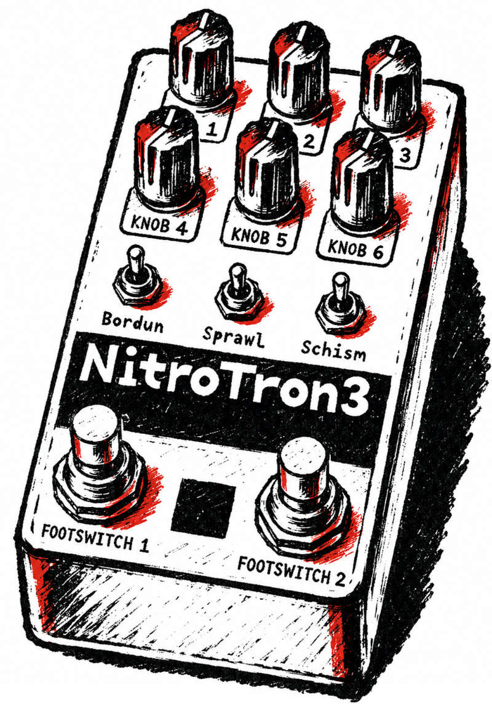
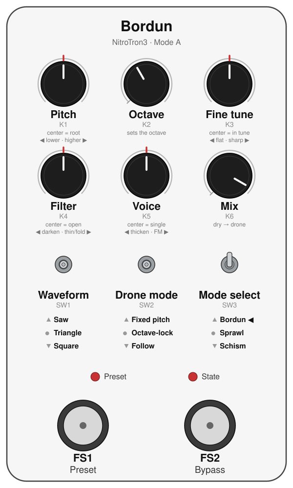
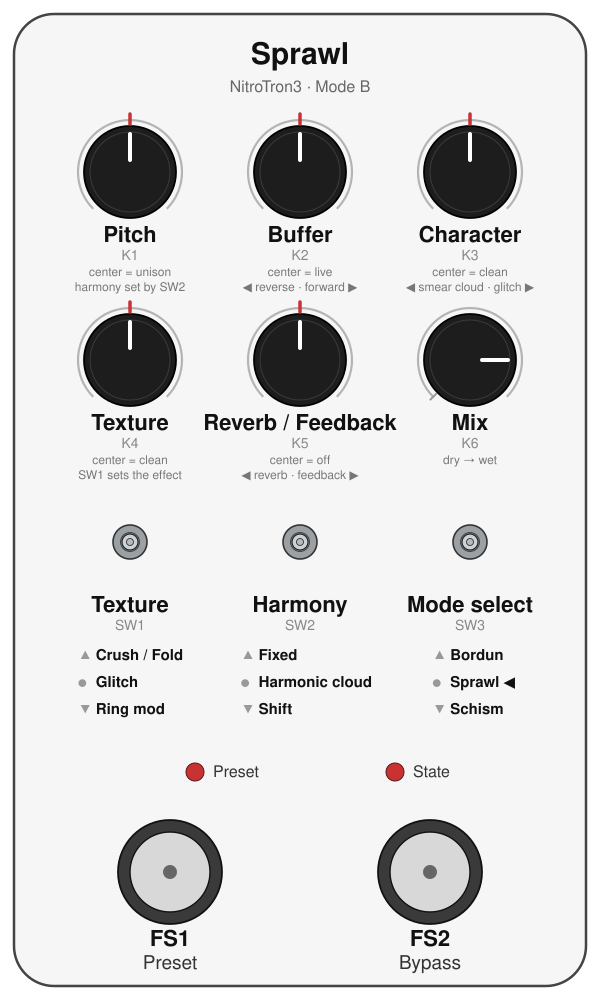
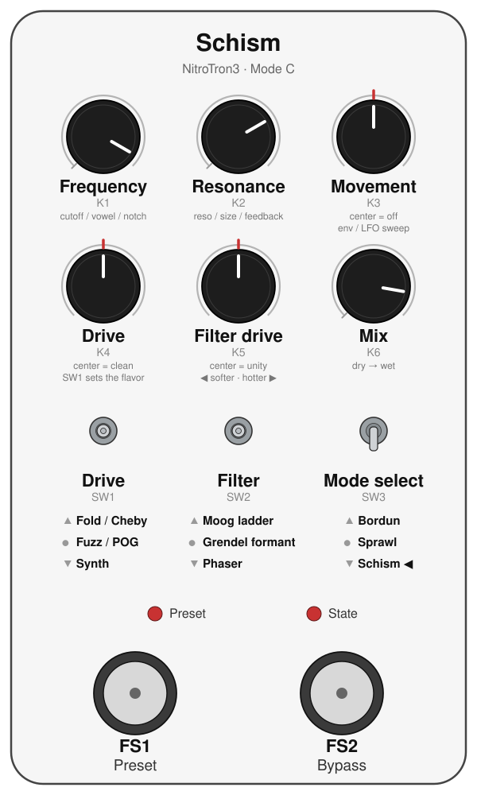

{.cover}

A project of [Nitro Mahalia](https://nitromahalia.net). This pedal
packages several of their signature bass-through-synth sounds into a
single bass-specific unit and more: three distinct modes, each doing
something not easily found in off-the-shelf pedals. Built on the
Electro-Smith Daisy Seed and Cleveland Music Co. Hothouse DSP kit.

## Modes at a glance

**BORDUN (Mode A).** A harmonic companion to the bass, modelled after a
specific usage of the Moog MoogerFooger FreqBox (MF-107) — its
envelope-gated oscillator mixed in alongside the dry signal, kept clean
of sync and FM modulation. An internally generated oscillator, gated and
shaped by the bass's own envelope, lays subtle or assertive
accompanying harmonics over the input — pure intervals, fifths, octaves,
drone-like wash. Placed **before** overdrive in the chain it stacks
musically into a saturated sound; on its own it sits as a parallel voice
along the played notes. Tracking modes lock the harmony to the played
pitch; fixed mode anchors a drone against which the bass moves.

**SPRAWL (Mode B).** Granular-delay-based texture and soundscape engine.
A rolling buffer feeds a grain scheduler whose voices can pitch-shift
non-linearly, drift, scatter, and stutter — built to fill the void
around the bass, intended for improvisation and experimental
performance. Functionally a multi-mode effect on its own: all colouring
and texturing stages (decimator/fold, event-driven glitch, ringmod,
frequency shifter) are reachable in a non-delay path too (K2 at noon).
High feedback with the tanh saturator pushes the loop into harmonic
cloud blooms; the Bode SSB shifter inside the feedback loop cascades
each pass and rapidly grows beyond pitched material.

**SCHISM (Mode C).** Dynamic bass filter and digital distortion unit,
with a fat pitch-tracked synth voice as a third drive option. The
filter can self-oscillate in a controlled manner — singing-into-screaming
textures that play well into a downstream overdrive or fuzz. The
bit-XOR drive enriches overtones cleanly and lights up especially well
placed **before** overdrive/fuzz. The phaser sub-mode is provisional
and likely to be replaced with a different effect in a future release.

**Presets.** A global preset system recalls mode + full parameter state
in one footswitch press. One global edit buffer, 3 banks × 8 slots = 24
reachable presets. Each slot carries its own mode, so cycling presets
can swap mode mid-set. See the _Footswitches and Presets_ section
below.

## Hardware overview

- 6 knobs (K1–K6, left-to-right, top row then bottom)
- 3 three-position toggle switches (SW1–SW3)
- 2 footswitches (FS1 = preset / FS2 = bypass; both held together for
  bank-cycle / bootloader)
- 2 indicator LEDs

**SW3 selects the mode**:

- **UP** — BORDUN (Mode A)
- **MIDDLE** — SPRAWL (Mode B)
- **DOWN** — SCHISM (Mode C)

The mode determines what every other knob and switch does. Each mode is
documented in its own section below.

## Reading the knob icons

The control tables use these icons to show which way a knob is turned:

|                       Icon                        | Meaning                                                            |
| :-----------------------------------------------: | ------------------------------------------------------------------ |
|     {.icon-legend}     | Turn **counter-clockwise** (left of centre)                        |
|      {.icon-legend}      | Turn **clockwise** (right of centre)                               |
|    {.icon-legend}    | **Centre** (noon) — bipolar knobs rest here                        |
| {.icon-legend} | **Bipolar** — knob has a neutral centre and two opposite functions |
|    {.icon-legend}    | Full **sweep**, min → max (unipolar knobs)                         |
|   {.icon-legend}   | **Stepped** — selects discrete values or presets                   |

---

# BORDUN (Mode A)

An oscillator voice (waveform via SW1) tracks the bass input, gated by
an envelope follower so the drone only sounds while you play. K5 shapes
the oscillator — clockwise adds audio-rate FM from your input, counter-
clockwise thickens it per waveform (unison cloud, just-intonation
ensemble, or PWM). K4 is a bipolar filter: a Moog ladder low-pass toward
CCW and a high-pass toward CW (in triangle mode the CW side folds the
waveform instead). SW2 picks the pitch source: fixed, octave-locked
tracking, or direct tracking.

{.pedal-layout}

## Controls

| CONTROL | NOTES |
|-|-|
| **Pitch / interval** Knob 1 | {.ctl-icon} {.ctl-icon} ±12 semitone offset, centered with deadzone. **Fixed**: center = A (drone root). **Track**: adds an interval to the tracked pitch                                                                                                                                                                                                                                                    |
| **Octave** Knob 2 | {.ctl-icon} 7 steps. **Fixed**: base octave. **Octave-locked**: target octave the pitch folds into. **Direct**: octave offset from the played pitch. At noon all three modes sit ~2 octaves above a played note                                                                                                                                                                                                                             |
| **Fine tune** Knob 3 | {.ctl-icon} ±50 cents continuous                                                                                                                                                                                                                                                                                                                                                                                                                    |
| **Filter** Knob 4 | {.ctl-icon} {.ctl-icon} = ladder wide open. **SAW/SQR**: {.ctl-icon} = low-pass closing (8 kHz → 250 Hz) with rising drive/saturation; {.ctl-icon} = high-pass opening (20 Hz → 2 kHz), thinning the low end. **TRI**: {.ctl-icon} = ladder cutoff sweep; {.ctl-icon} = wavefolder (ladder stays open) |
| **Voice** Knob 5 | {.ctl-icon} {.ctl-icon} = single clean oscillator. {.ctl-icon} = audio-rate FM (input frequency-modulates the osc, through-zero; grows with knob and playing level). {.ctl-icon} by waveform — **SAW**: detuned unison cloud; **TRI**: just-intonation ensemble (chord builds up, one octave up); **SQR**: PWM (duty-cycle modulation)                 |
| **Mix** Knob 6 | {.ctl-icon} 0 = full dry, 1 = full wet (oscillator)                                                                                                                                                                                                                                                                                                                                                                                                       |
| **Waveform** Switch 1 | **UP** — Saw **MIDDLE** — Triangle **DOWN** — Square                                                                                                                                                                                                                                                                                                                                                                                                                           |
| **Drone mode** Switch 2 | **UP** — Fixed pitch (K1 sets note, K2 sets octave) **MIDDLE** — Octave-locked tracking (played pitch class folds into K2's octave, K1 adds interval) **DOWN** — Follow / direct tracking (osc follows the played pitch, transposed by K1 ±12 semi and K2 octave)                                                                                                                                                                                                              |

---

# SPRAWL (Mode B)

8-second SDRAM ring buffer feeding 8 grain voices, with a choice of
texture shaper (SW1) and harmony source (SW2). K5 is bipolar — CCW
routes the wet bus through a Clouds reverb, CW drives a tanh-saturated
feedback loop with build-up and on-play duckers that keep the loop
musical. K2 is bipolar around noon: noon bypasses the grain engine and
routes the dry through the texture shaper directly (K3 becomes a
micro-stutter control), and off noon the sign sets grain playback
direction (CW forward, CCW backward). SW2 DOWN replaces grain
pitch-shifting with a Bode SSB
frequency shifter living inside the feedback loop.

{.pedal-layout}

## Controls

| CONTROL | NOTES |
|-|-|
| **Pitch** Knob 1 | {.ctl-icon} {.ctl-icon} Meaning follows SW2. **SW2=UP**: fixed interval, K1 = ±12 semitones. **SW2=MID**: harmonic-cloud pick, K1 spans the ±36-semitone scan. **SW2=DOWN**: Bode SSB frequency shifter on the wet bus, bipolar with ±2 % deadzone — {.ctl-icon} = down-shift (bass), {.ctl-icon} = up-shift, exponential taper, ±1 kHz at full deflection. In SW2 DOWN the grain buffer-read pitch is forced to unison                                                                                                                               |
| **Buffer** Knob 2 | {.ctl-icon} {.ctl-icon} **(±6 %)** = direct-texture (grain engine bypassed, K3 = micro-stutter). Off noon either way = buffer depth 100 ms → 8 s + timescale; sign = playback direction ({.ctl-icon} forward, {.ctl-icon} backward). Fully {.ctl-icon} = deepest buffer, played backward                                                                                                                                                                                                                                                 |
| **Character** Knob 3 | {.ctl-icon}**Grain mode**: {.ctl-icon} = long, slow smear (grains stretch ~0.3 → 2 s, overlap held so the rate falls — a granular multi-tap that leans on the deep buffer), {.ctl-icon} = short/sharp/chaotic glitch. **Direct-texture mode**: micro-stutter — {.ctl-icon} = clean, {.ctl-icon} = frequent choppy repeats                                                                                                                                                                                                                |
| **Texture** Knob 4 | {.ctl-icon} Depends on SW1 position — see below                                                                                                                                                                                                                                                                                                                                                                                                                                                                                                                                                                                                      |
| **Reverb / Feedback** Knob 5 | {.ctl-icon} **{.ctl-icon}** = Clouds reverb amount (0 → 1). {.ctl-icon} **(±5 %)** = off. **{.ctl-icon}** = ring-buffer feedback (0 → full) into the tanh saturator — ducked and self-limiting into a controlled drone, not a runaway. Reverb tail does not feed the ring buffer                                                                                                                                                                                                                                                                                    |
| **Mix** Knob 6 | {.ctl-icon} 0 = full dry, 1 = full wet. Equal-power curve                                                                                                                                                                                                                                                                                                                                                                                                                                                                                                                                                                                                  |
| **Texture** Switch 1 | **UP** — Crush / Fold — decimator/wavefolder (K4 {.ctl-icon} = max crush, {.ctl-icon} = clean, {.ctl-icon} = wavefold) **MIDDLE** — Glitch — event-driven digital glitch (bipolar K4: {.ctl-icon} = clean ±5 %, {.ctl-icon} = random bit-flip events, {.ctl-icon} = random timing events — freeze / stutter / reverse; sparse near noon → continuous at the extremes via event chaining) **DOWN** — Ring mod (K4 0 – 30 % = tremolo 1 – 15 Hz, 30 – 100 % = bell partials, pitch-tracked with keytracked LPF) |
| **Harmony** Switch 2 | **UP** — Fixed — fixed interval (K1 = ±12 semitones above tracked note) **MIDDLE** — Harmonic cloud (grains scatter across nearby harmonics; K1 spans ±36-semi scan) **DOWN** — Shift — Bode SSB frequency shifter on the wet bus (inside the feedback loop). Grain buffer-read pitch forced to unison; K1 = ±1 kHz exponential                                                                                                                                                                                                                                                                                                                                                 |

---

# SCHISM (Mode C)

Two-stage chain: drive (SW1) → filter (SW2). K1–K3 drive the filter
selected by SW2; K4 drives the source flavor selected by SW1
(wavefolder / waveshaper, bit-flipper fuzz / POG octave stack, or
pitch-tracked synth oscillator). For SW1=UP and SW1=MID, K4 is bipolar around noon:
noon = clean dry, one flavor each side. K5 is a bipolar pre-filter drive
(attenuate / unity / boost, universal across all SW2 filter modes); K6
is the dry/wet mix.

Three filter flavors: a tuned **Moog ladder** (single input saturator,
cutoff-tracked resonance, asymmetric drive), a vowel-pathed **Grendel
formant** filter, and a 6-stage **phaser** with internal LFO. The
phaser runs slightly detuned per stage (organic, less "digital") with a
soft-saturated feedback loop, so K2 sweeps from a clean sweep up into
a resonant bloom / controlled self-oscillation. K3 is a bipolar
envelope-to-filter modulator with a center deadzone (or, on the phaser,
a bipolar LFO rate + shape selector).

Three drive flavors. For **SW1=UP** and **SW1=MIDDLE**, K4 is bipolar
around noon (noon = clean dry): turning it clockwise from noon brings up
one flavor, counter-clockwise the other. **SW1=UP** is the sine
wavefolder (K4 CW) and a Chebyshev waveshaper (K4 CCW) — an octave-up /
metallic harmonic generator with a pre-shaper low-pass so it makes a
clean octave instead of intermod mush. **SW1=MIDDLE** is a gated
bit-flipper driving an **octave-fuzz** (K4 CW): the XOR bit-flipper (a
chosen bit flipped every sample, swept upward by K4, input-envelope
gated) feeds a fuzz chain — full-wave-rectified octave-up into a
CMOS-style sputtering, glitchy clip cascade. The fuzz reaches max early
in the travel, so most of the sweep moves the XOR bit through a maxed
fuzz. K4 CCW is a **POG octave stack** (polyphonic octave generator —
filterbank-based, fully polyphonic, no pitch tracking): the travel
first crossfades the clean signal against a sub-octave, then a +1
octave and a +2 octave stack in; full CCW is the whole organ stack,
with no dry left in the stage (K6 re-adds global dry). **SW1=DOWN**
is a pitch-tracked
synth oscillator: the bass note is tracked (YIN, semitone-quantized) and
an oscillator engine replaces the dry path, amplitude-gated by the env
follower before it hits the filter. Here K4 is full-range (no noon
split) and morphs the timbre — saw on the left half (max hypersaw at
full CCW, single saw just below noon), rect on the right half (single
rect just past noon, pulse-width modulated at full CW).

The wet path runs through a 2-band post-filter peak limiter — the low
end is preserved so bass fundamentals don't duck under resonance peaks.

{.pedal-layout}

## Controls

| CONTROL | NOTES |
|-|-|
| **Frequency** Knob 1 | {.ctl-icon}SW2=UP: Moog cutoff (20 Hz – 8 kHz, exponential). SW2=MID: Grendel vowel path ({.ctl-icon} = oo dark/closed, {.ctl-icon} = ee bright/open). SW2=DOWN: phaser notch centre                                                                                                                                                                                                                                                                                                                                                                                                                                                                                                                                                                                                                                                                                                                                           |
| **Resonance** Knob 2 | {.ctl-icon}SW2=UP: Moog resonance (0 → self-osc, sqrt curve so the lower half is audible). SW2=MID: Grendel size (mouth scale, ×0.5 → ×1.6). SW2=DOWN: phaser feedback (clean sweep → resonant bloom → controlled self-oscillation at full {.ctl-icon})                                                                                                                                                                                                                                                                                                                                                                                                                                                                                                                                                                                                                                                                                                   |
| **Movement** Knob 3 | {.ctl-icon} Runs through a response curve (fine near noon, coarse toward the extremes). SW2=UP: bipolar env-to-cutoff (passive-bass scaled). SW2=MID: bipolar env on vowel path and size. SW2=DOWN: bipolar phaser LFO rate (sign selects shape — {.ctl-icon} triangle, {.ctl-icon} sample-and-hold; magnitude = rate; centre = LFO off, static notch at K1). All with ±5 % centre deadzone                                                                                                                                                                                                                                                                                                                                                                                                                                                                                                                          |
| **Drive** Knob 4 | {.ctl-icon} Bipolar around noon ({.ctl-icon} = clean dry) for SW1=UP and SW1=MID. SW1=UP: {.ctl-icon} = sine wavefold (0 → max, internal loudness comp), {.ctl-icon} = Chebyshev waveshaper (octave-up / metallic). SW1=MID: {.ctl-icon} = gated bit-flipper into octave-fuzz (XOR bit position swept by K4, env-gated; the rectified, sputtery fuzz maxes early in the travel), {.ctl-icon} = POG octave stack (clean crossfades into sub-octave, then +1 and +2 octaves stack in; full {.ctl-icon} = whole organ stack, dry via K6). SW1=DOWN: synth-osc timbre (full-range) — {.ctl-icon} half = saw (max hypersaw at fully {.ctl-icon} → single saw plateau just below noon), {.ctl-icon} half = rect (single rect just past noon → max PWM at full {.ctl-icon}; depth ramps in fast, then LFO rate) |
| **Filter drive** Knob 5 | {.ctl-icon} **{.ctl-icon}** attenuates (~−12 dB at full {.ctl-icon}). **Noon** is unity. **{.ctl-icon}** boosts up to 8× hot. Sets the Moog ladder's input drive; pre-tanh in front of Grendel and the phaser. Moog and Grendel have a fixed internal pad so noon sits in their clean sweet zone                                                                                                                                                                                                                                                                                                                                                                                                  |
| **Mix** Knob 6 | {.ctl-icon} 0 = full dry, 1 = full wet. Equal-power curve                                                                                                                                                                                                                                                                                                                                                                                                                                                                                                                                                                                                                                                                                                                                                                                                                                                                                                                                  |
| **Drive** Switch 1 | **UP** — Fold / Cheby — sine wavefolder (K4 {.ctl-icon}) / Chebyshev waveshaper (K4 {.ctl-icon}), {.ctl-icon} = clean **MIDDLE** — Fuzz / POG — gated bit-flipper into octave-fuzz (K4 {.ctl-icon}, env-gated) / POG octave stack (K4 {.ctl-icon}), {.ctl-icon} = clean **DOWN** — Synth — pitch-tracked synth oscillator (K4 = saw ↔ rect timbre morph)                                                                                                                                                                                                                                                                                                                                                                                                                                                                                    |
| **Filter** Switch 2 | **UP** — Moog ladder (K1 cutoff, K2 resonance, K3 env) **MIDDLE** — Grendel formant (K1 vowel path, K2 size, K3 env on path) **DOWN** — Phaser (K1 notch centre, K2 feedback, K3 LFO rate/shape)                                                                                                                                                                                                                                                                                                                                                                                                                                                                                                                                                                                                                                                                                                                                                                                                                |

---

# Footswitches and Presets

The footswitches and the preset system work the same way in every mode.

## Footswitches

| CONTROL             | DESCRIPTION                                                                                                                                                             |
| ------------------- | ----------------------------------------------------------------------------------------------------------------------------------------------------------------------- |
| FOOTSWITCH 1        | **Short press**: cycle Manual → 1 → … → 8 → Manual (or reload the current preset if dirty). **Long press (700 ms)**: jump to Manual                                     |
| FOOTSWITCH 2        | **Short press**: toggle bypass. **Long press (700 ms)**: enter save mode, or confirm save if already in save mode. **Short press in save mode**: cancel save            |
| FS1 + FS2 short tap | Cycle the active bank (1 → 2 → 3 → 1). Both LEDs play a Roman-numeral burst confirming the new bank. Also works inside save mode to retarget the save into another bank |
| FS1 + FS2 held 2 s  | Enter DFU bootloader for flashing new firmware (both LEDs alternate for 1.2 s before reset)                                                                             |

## Indicator LEDs

| LED           | DESCRIPTION                                                                                                                                                                                                                                                           |
| ------------- | --------------------------------------------------------------------------------------------------------------------------------------------------------------------------------------------------------------------------------------------------------------------- |
| LED 1 (left)  | **Preset indicator.** Off = Manual mode. Otherwise a Roman-numeral blink pattern shows the preset number (I = short, V = long: I, II, III, IV, V, VI, VII, VIII). In save mode, shows the target slot                                                                 |
| LED 2 (right) | **State indicator.** Solid = active, off = bypassed, rapid flash = dirty (preset edited but not saved), fast blink = save mode armed, burst = save confirmed                                                                                                          |
| Both LEDs     | **Bank-switch burst.** On bank change, both LEDs flash a Roman-numeral pattern of the new bank number (I / II / III, each pulse filled with deterministic fast flicker so it's visually distinct from a preset blink) for ~1.6 s, then return to their normal display |

## Preset behavior

- **One global edit buffer**, shared across all modes. Manual mode is
  fully WYSIWYG — what the panel shows is what plays.
- **3 banks × 8 slots = 24 reachable presets.** Each slot stores its
  own mode, knobs, SW1 and SW2, so cycling presets can swap mode
  mid-set.
- **Bank cycling** (FS1+FS2 short tap, 1 → 2 → 3 → 1): in manual the
  bank changes silently; on a saved preset the same slot number loads
  from the new bank; in save mode the save target shifts into the new
  bank (cross-bank save).
- **Dirty marking.** Adjusting any knob or switch — including SW3 —
  while on a saved preset dirties it (LED 2 rapid flash). Short-press
  FS1 while dirty to reload the preset and discard edits.
- **Save flow.** Long-press FS2 to enter save mode (LED 2 fast blink;
  LED 1 shows the target slot). Short-press FS1 to cycle the target
  slot; FS1+FS2 short tap to cycle the bank; long-press FS2 to confirm
  (LED 2 burst, returns to normal mode with the preset now clean);
  short-press FS2 to cancel.
- **Power-cycle behavior.** The pedal restores the full state on boot:
  active bank, active preset, the edit buffer (including mode), dirty
  flag. State is written to flash on a debounced 2-second timer after
  the last change — no writes happen when nothing is changing.
- **Migration.** Presets saved under older firmware (one bank per mode)
  are migrated on first boot of the new firmware: Mode A's slots →
  Bank 1, Mode B's slots → Bank 2, Mode C's slots → Bank 3, with each
  slot tagged with its source mode. No data loss.

---

# Guitar build

NitroTron3 is voiced for bass — pitch tracking, envelope response, and
several filter voicings assume bass range. For electric guitar there is a
separate firmware variant, built from source with `make INSTRUMENT=guitar`,
that shifts the pitch tracker and those voicings up into guitar range.
Controls, modes, and presets are identical. One firmware serves one
instrument — reflash to switch.
